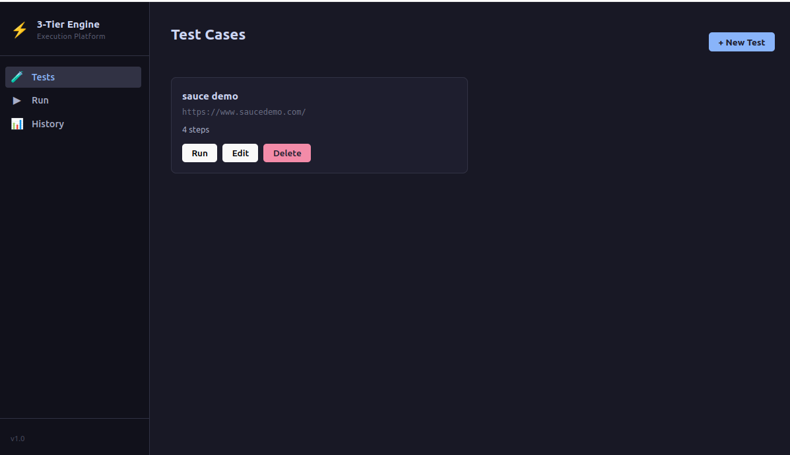
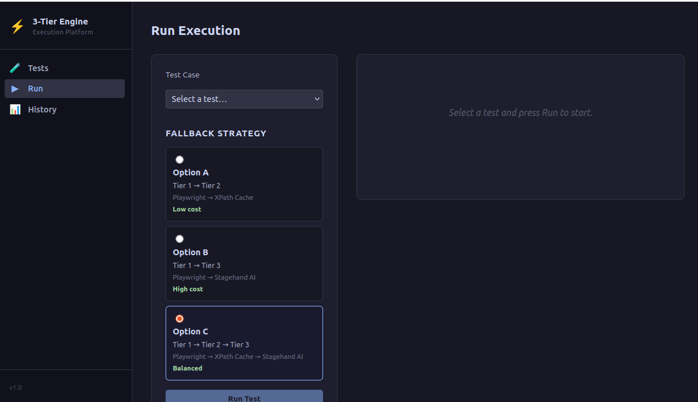

# 3-Tier Execution Engine — AI Web Test Platform

> **Portfolio Case Study** — Full-stack feature built as part of a team AI test automation platform.  
> I designed and implemented both the backend execution engine and the frontend settings UI.

---

## Getting Started

### Prerequisites

| Tool | Version |
|------|---------|
| Python | 3.12+ |
| Node.js | 20+ |
| Docker & Compose | (optional — for one-command setup) |

### Option 1 — Local Dev (make dev)

```bash
# 1. Clone and install all dependencies
git clone <repo-url>
cd 3-tier-execution-engine
make setup

# 2. Configure environment (defaults work without an API key)
cp backend/.env.example backend/.env
# Edit backend/.env to add OPENROUTER_API_KEY if you want real Tier 3 LLM calls

# 3. Apply database migrations
make migrate

# 4. Seed demo test cases and start both servers
make demo
#   Backend API docs → http://localhost:8000/docs
#   Frontend app    → http://localhost:5173
```

Alternatively, start just the servers (no seed data):

```bash
make dev
```

### Option 2 — Docker Compose (one command)

```bash
docker compose up --build
#   Frontend → http://localhost:5173
#   API docs → http://localhost:8000/docs
```

To also seed the demo test cases:

```bash
make docker-demo
```

### Environment Variables

| Variable | Default | Description |
|----------|---------|-------------|
| `DATABASE_URL` | `sqlite+aiosqlite:///./engine.db` | SQLite connection string |
| `STAGEHAND_MOCK` | `true` | Use mock Tier 2/3 — no API key required |
| `STAGEHAND_ENABLED` | `false` | Enable real Stagehand browser AI |
| `OPENROUTER_API_KEY` | _(empty)_ | API key for Tier 3 LLM calls |
| `CORS_ORIGINS` | `["http://localhost:5173"]` | Allowed frontend origins |

> **Demo mode:** `STAGEHAND_MOCK=true` (the default) makes Tier 2 and Tier 3 return  
> plausible mock results so the full tier cascade is visible without any paid API key.

### Running Tests

```bash
make test           # pytest (backend) + vitest (frontend)
make test-backend   # backend only, with coverage report
make test-frontend  # frontend only
```

---


Web UI tests fail frequently when HTML structure changes — a hardcoded CSS selector breaks, the test suite fails, and engineers spend hours manually patching selectors. In large test suites this becomes a significant maintenance burden.

**The challenge**: Build an execution layer that can **self-recover from selector failures** without human intervention, while keeping AI inference costs under control.

---

## My Solution: The 3-Tier Execution Engine

A configurable fallback system that automatically escalates from fast/cheap execution to progressively more intelligent (but costlier) approaches, only when needed.

```
Test Step Instruction
        │
        ▼
┌───────────────────────────────────────────────────────────────┐
│                Tier 1 — Direct Playwright                     │
│  CSS / XPath selector → execute immediately                   │
│  Speed: fastest  │  Cost: $0 (no LLM)  │  Success: 85–90%    │
└───────────────────────────┬───────────────────────────────────┘
                            │ FAIL ↓
                            ▼
┌───────────────────────────────────────────────────────────────┐
│            Tier 2 — Hybrid (XPath + Cache)                    │
│  Stagehand observe() → extracts live XPath → caches result   │
│  Speed: 5–10× faster on cache hits  │  Success: 90–95%       │
└───────────────────────────┬───────────────────────────────────┘
                            │ FAIL ↓
                            ▼
┌───────────────────────────────────────────────────────────────┐
│              Tier 3 — Stagehand AI (act)                      │
│  Full LLM reasoning from natural-language instruction         │
│  Speed: slowest  │  Cost: highest  │  Success: 60–70%         │
└───────────────────────────────────────────────────────────────┘
```

**Expected distribution (Option C — recommended):**
| Tier | % of Steps | Cost |
|------|-----------|------|
| Tier 1 | ~85% | $0 |
| Tier 2 (cache hit) | ~10% | Very low |
| Tier 2 (cache miss) | ~2% | Low |
| Tier 3 | ~1% | Medium |
| All fail | ~2% | — |

Result: **97–99% execution success rate** while ~97% of processing runs at zero LLM cost.

---

## Configurable Fallback Strategies

Users can choose their trade-off via the settings UI:

| Strategy | Flow | Success Rate | Cost Profile | Best For |
|----------|------|-------------|-------------|----------|
| **Option A** | Tier 1 → Tier 2 | 90–95% | Low | Stable pages, cost-sensitive |
| **Option B** | Tier 1 → Tier 3 | 92–94% | Medium | Complex dynamic UIs |
| **Option C** ⭐ | Tier 1 → Tier 2 → Tier 3 | **97–99%** | Balanced | Maximum reliability |

---

## Screenshots & Demo

### Test Cases — Manage & Run Tests


### Run Execution — Fallback Strategy Picker


### Demo Video


---

## Architecture & Tech Stack

**Backend** — Python / FastAPI  
**Browser Automation** — Playwright (Chromium), Stagehand  
**Database** — SQLAlchemy (SQLite dev / PostgreSQL prod)  
**Frontend** — React + TypeScript + Vite  
**LLM Providers** — OpenRouter, Google Gemini, Cerebras, Azure OpenAI

```
backend/
└── app/
    └── services/
        ├── three_tier_execution_service.py  ← Main orchestrator (357 lines)
        ├── tier1_playwright.py              ← Direct execution (189 lines)
        ├── tier2_hybrid.py                  ← XPath + cache (226 lines)
        ├── tier3_stagehand.py               ← Full AI fallback (105 lines)
        ├── xpath_cache_service.py           ← SHA-256 caching (309 lines)
        └── xpath_extractor.py               ← Stagehand observe() (160 lines)

frontend/
└── src/
    └── components/
        ├── ExecutionSettingsPanel.*         ← Strategy picker UI
        └── TierAnalyticsPanel.*             ← Live tier distribution charts
```

Total: **10 files, ~2,000 lines** built in Sprint 5.5 (5 days).

---

## Key Implementation Highlights

### 1. Orchestrator — Strategy Router

```python
# three_tier_execution_service.py (simplified excerpt)
class ThreeTierExecutionService:
    """
    Orchestrates fallback execution across 3 tiers.
    Strategy is per-user and configurable at runtime.
    """
    async def execute_step(
        self,
        step: Dict[str, Any],
        execution_id: int,
        step_index: int,
    ) -> Dict[str, Any]:

        # Tier 1 always runs first
        result = await self._execute_tier1(step)
        if result["success"]:
            return result | {"tier": 1}

        strategy = self.user_settings.fallback_strategy  # option_a | b | c

        if strategy in ("option_a", "option_c"):
            result = await self._execute_tier2(step)
            if result["success"]:
                return result | {"tier": 2}

        if strategy in ("option_b", "option_c"):
            result = await self._execute_tier3(step)
            if result["success"]:
                return result | {"tier": 3}

        return {"success": False, "error": "All tiers exhausted", ...}
```

### 2. Tier 2 — XPath Caching (80–90% token savings on repeat runs)

```python
# xpath_cache_service.py (simplified excerpt)
class XPathCacheService:
    """
    Caches XPath selectors extracted by Stagehand to avoid
    repeated LLM calls for the same element on the same page.
    Cache key = SHA-256(page_url + step_instruction + action).
    Auto-invalidates after 3 consecutive validation failures (self-healing).
    """
    def get_cached_xpath(self, page_url: str, instruction: str, action: str):
        cache_key = self._generate_key(page_url, instruction, action)
        entry = self.db.query(XPathCache).filter_by(cache_key=cache_key).first()

        if entry and entry.validation_failures < 3:
            entry.hit_count += 1
            return entry.xpath_selector

        return None  # Cache miss → trigger Stagehand observe()

    def _generate_key(self, page_url, instruction, action) -> str:
        raw = f"{page_url}|{instruction.lower().strip()}|{action}"
        return hashlib.sha256(raw.encode()).hexdigest()
```

### 3. Execution Settings API

```
GET  /api/v1/settings/execution          → Returns user's current strategy + tier config
PUT  /api/v1/settings/execution          → Update fallback strategy, timeouts, retry count
GET  /api/v1/analytics/tier-distribution → Live stats on which tier is succeeding per user
```

### 4. Frontend — Strategy Picker (React / TypeScript)

```tsx
// ExecutionSettingsPanel.tsx (illustrative excerpt)
const STRATEGIES = [
  { id: "option_a", label: "Option A: Playwright → XPath",      successRate: "90–95%" },
  { id: "option_b", label: "Option B: Playwright → Stagehand",  successRate: "92–94%" },
  { id: "option_c", label: "Option C: Full Fallback (Recommended)", successRate: "97–99%" },
];

export function ExecutionSettingsPanel() {
  const [strategy, setStrategy] = useState("option_c");

  return (
    <RadioGroup value={strategy} onValueChange={setStrategy}>
      {STRATEGIES.map(s => (
        <StrategyCard
          key={s.id}
          label={s.label}
          badge={s.successRate}
          recommended={s.id === "option_c"}
        />
      ))}
    </RadioGroup>
  );
}
```

---

## Testing

| Test Suite | Coverage | Result |
|-----------|----------|--------|
| `test_sprint5_5_unit_tests.py` | ExecutionSettings model, XPath cache, all 3 strategies | ✅ 100% |
| `test_sprint5_5_three_tier.py` | Full execution flow per strategy | ✅ 100% |
| `test_3tier_integration.py` | Integration with ExecutionService | ✅ 100% |
| `test_sprint5_5_api_endpoints.py` | Settings + analytics API | ✅ 100% |

---

## How It Works — Tier Cascade Walkthrough

When a test step is executed the orchestrator in `three_tier_service.py` attempts each tier in order, stopping as soon as one succeeds.

### Step 1 — Tier 1: Direct Playwright (always first)

```python
# three_tier_service.py
result = await self.tier1.execute_step(page, step)
if result.success:
    return result  # ✅ ~85 % of steps end here — zero LLM cost
```

Tier 1 uses the step's `selector` field to call Playwright directly:

```python
# tier1_playwright.py
await page.locator(step.selector).click(timeout=self.timeout_ms)
```

If there is no selector, or the element is not found, Tier 1 raises and the orchestrator falls through to the configured fallback.

### Step 2 — Tier 2: Hybrid XPath + Cache (Option A or C)

```python
# tier2_hybrid.py  (cache-first path)
cached_xpath = await self.cache.get(instruction=step.instruction, page_url=page.url)
if cached_xpath:
    await page.locator(f"xpath={cached_xpath}").click()   # T2-cached badge
    return TierResult(tier=2, success=True, xpath_cached=True, ...)

# Cache miss — ask Stagehand to observe the live DOM
xpath = await self.stagehand.observe(step.instruction)
await self.cache.store(step.instruction, page.url, xpath)  # warm the cache
await page.locator(f"xpath={xpath}").click()              # T2 badge
```

Cache key = `SHA-256(normalised_instruction + url_pattern)`.  
On the **second run** of the same test the cache is warm and Tier 2 runs at near-Tier-1 speed with no LLM call.

### Step 3 — Tier 3: Full Stagehand AI (Option B or C)

```python
# tier3_stagehand.py
success = await self.stagehand.act(step.instruction)  # full LLM reasoning
return TierResult(tier=3, success=success, ...)
```

`act()` gives Stagehand the natural-language instruction and lets it reason about the page DOM. This handles dynamic/obscured elements that neither Playwright selectors nor XPath observation can reach.

### Configurable fallback strategies

```python
# three_tier_service.py — strategy routing
if strategy in ("option_a", "option_c"):
    result = await self.tier2.execute_step(page, step)
    if result.success:
        return result

if strategy in ("option_b", "option_c"):
    result = await self.tier3.execute_step(page, step)
    if result.success:
        return result

return TierResult(success=False, error="All tiers exhausted")
```

| Strategy | Tier sequence | Best for |
|----------|--------------|----------|
| **Option A** | T1 → T2 | Cost-sensitive — avoids Tier 3 entirely |
| **Option B** | T1 → T3 | Complex dynamic UIs where XPath is fragile |
| **Option C** ⭐ | T1 → T2 → T3 | Maximum reliability (default) |

### Real-time progress via Server-Sent Events

After `POST /api/v1/executions`, the browser connects to `GET /api/v1/executions/{id}/stream`.  
The backend emits one SSE event per completed step:

```
data: {"step_index": 2, "tier": 1, "success": true, "duration_ms": 43, "xpath_cached": false}
```

The React `useSSE` hook in `api.ts` consumes the stream and updates the `ExecutionProgress` component in real time — each step card transitions from a spinner to a coloured tier badge (`T1` green / `T2` amber / `T3` red).

---

## Design Decisions & Trade-offs


**Why 3 tiers instead of going straight to AI?**  
LLM inference adds 1–5 seconds latency per step and costs money at scale. 85% of steps have stable selectors — Tier 1 handles those instantly at zero cost. AI is reserved for the cases that genuinely need it.

**Why XPath caching in Tier 2?**  
Stagehand's `observe()` extracts a live XPath from the DOM. The result is cacheable by `(page_url, instruction, action)`. On repeat runs, Tier 2 becomes as fast as Tier 1 with no LLM call — gaining the reliability of AI without the ongoing cost.

**Why SHA-256 for cache keys?**  
Instruction text can vary in whitespace or casing. Hashing normalised input gives a fixed-length, collision-resistant key suitable for indexed DB lookups.

**Why allow user-configurable strategies?**  
Different teams have different constraints — some prioritise cost, others reliability. Exposing the strategy as a user setting avoids hard-coding a one-size-fits-all policy.

---

## Results

- **97–99% overall test success rate** (up from ~85% with Tier 1 only)
- **~97% of executions run at $0 LLM cost**
- **5–10× faster Tier 2** on cache-hit runs vs. fresh Stagehand calls
- **Zero manual selector fixes** needed after deployment on target test suite
- Fully integrated with the platform's queue system (5 concurrent executions)

---

## What I Built

| Area | My Contribution |
|------|----------------|
| Backend orchestrator | `three_tier_execution_service.py` — strategy routing, lazy tier init, execution history |
| Tier 1 executor | `tier1_playwright.py` — 9 action types, timeout handling |
| Tier 2 hybrid | `tier2_hybrid.py` — XPath extraction, cache integration, self-healing |
| Tier 3 fallback | `tier3_stagehand.py` — Stagehand `act()` wrapper with natural-language passthrough |
| XPath cache | `xpath_cache_service.py` — SHA-256 keys, hit/miss tracking, TTL, auto-invalidation |
| Database schema | `ExecutionSettings`, `XPathCache`, `TierExecutionLog` models + Alembic migration |
| Settings API | GET/PUT endpoints + analytics endpoint |
| Frontend UI | `ExecutionSettingsPanel` (strategy picker) + `TierAnalyticsPanel` (live charts) |
| Test suite | ~4 test files, 100% coverage on all components |

---

## Related Platform Context

This 3-tier execution engine is one feature in a larger multi-agent test automation platform that:
- Generates test cases from natural language using LLMs (3 providers)
- Executes tests in real browsers with full screenshot capture per step
- Manages concurrent test runs via a queue system (max 5 simultaneous)
- Tracks execution history, failure patterns, and supports self-healing selectors

The 3-tier engine is the core of the execution layer — every test that runs goes through it.
